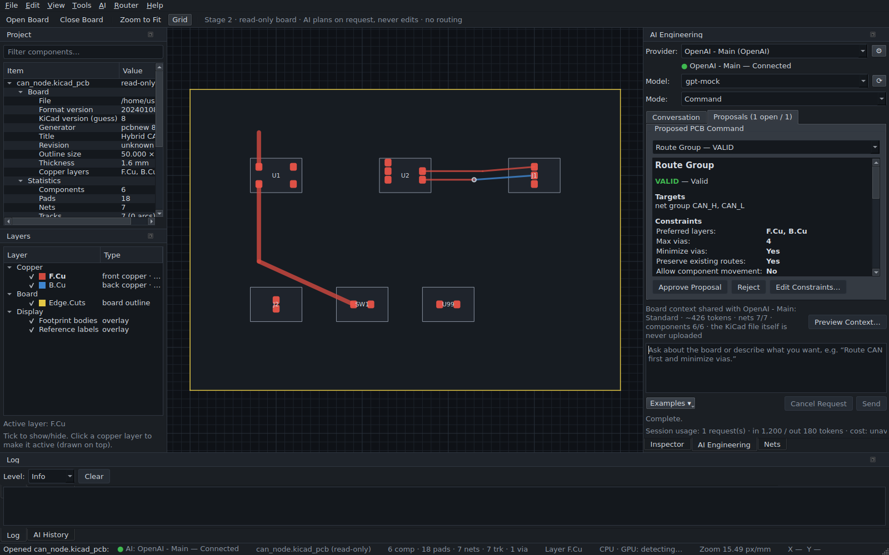
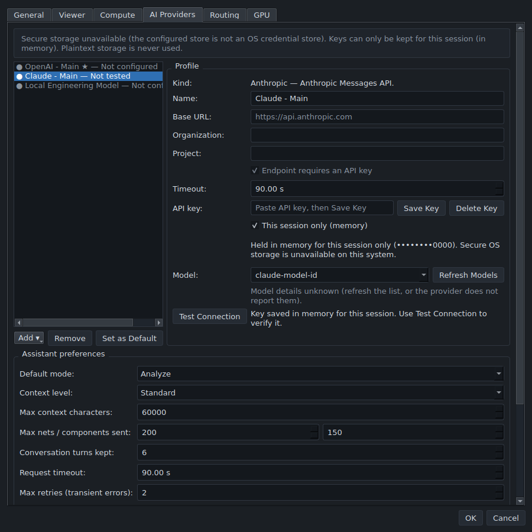
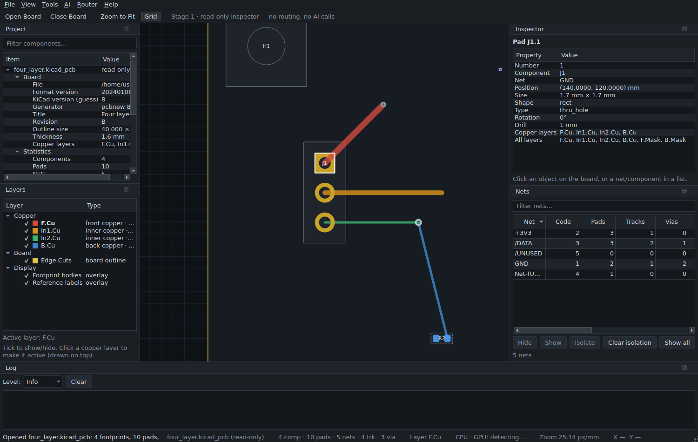
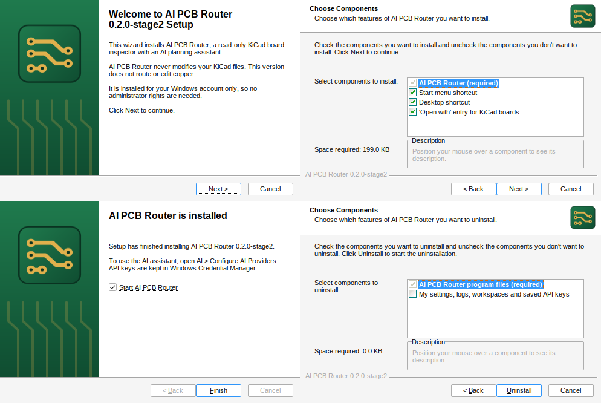

# AI PCB Router

A desktop PCB engineering application for **KiCad** boards, built toward
deterministic, AI-assisted autorouting.

**Current version: `0.9.0-stage9` — Stage 9: full-board routing, validated
commit/undo and export (CPU/GPU + Freerouting).**

> **The AI model is a planner, not the router.** It can analyse a board and
> propose structured commands. Every proposal is validated locally against the board and
> needs your approval. **Routing runs deterministically in a worker process;
> candidates are exact-validated, and exports write a new `.kicad_pcb` —
> your source files are never modified in place.**

---

## What works today

### Stage 1: read-only board inspector

- Loads `.kicad_pcb` files **read-only** (KiCad 5 → 9 formats; newer files load
  best-effort with a warning). The file's SHA-256 is checked on close to confirm it is
  unchanged.
- Converts the board into an internal domain model (integer nanometres) and shows it:
  - board outline, footprints and pads (SMD/THT/NPTH, rotated);
  - straight and arc tracks;
  - through, blind and micro vias, on any number of copper layers.
- **2D viewer**: pan, zoom, zoom-to-fit, adaptive grid, cursor coordinates, hover
  tooltips, click-to-select.
- **Panels**: Inspector, Nets, Layers and Project. Values the file does not state are
  shown as *unknown*, never invented.
- **Other**: CPU/GPU detection, persistent settings, and structured logging with secret
  redaction.
- **Headless CLI** that uses the same command bus as the GUI.

### Stage 2: AI planner

- **Providers**: OpenAI (Responses API), Anthropic (Messages API) and any
  **OpenAI-compatible** endpoint (LM Studio, Ollama, vLLM, …), all behind one interface.
- **Credentials**: API keys go in the **OS credential store** (Windows Credential Manager,
  macOS Keychain, Linux Secret Service). If no secure store exists, the key is held in
  memory for the current session only. Keys are never written as plaintext.
- **Settings ▸ AI Providers** covers:
  - multiple profiles and a default profile;
  - model list refresh, or a manual model ID;
  - a connection test;
  - context level, limits, timeout, retries, anonymisation and privacy options.
- **AI Engineering panel** (`Ctrl+I`):
  - four modes: *Analyze*, *Plan*, *Command*, *Explain*;
  - a context preview that shows exactly what would be sent;
  - Send and Cancel;
  - a proposal preview with the validation checklist and claim labels: **BOARD FACT**,
    **AI OBSERVATION**, **DRC RESULT**, **USER CONSTRAINT**;
  - Approve, Reject and Edit Constraints on each proposal.
- **Local validation of every AI command**:
  - Referenced nets, components and layers must exist. Unknown names get *suggestions*,
    never silent substitution.
  - Locks, consistency rules and board minimums are checked.
  - Proposals are tied to a board fingerprint, so a response for a different board state
    is marked stale.
- **AI History panel**, undo/redo of approve and reject decisions (`Ctrl+Z` /
  `Ctrl+Shift+Z`), session usage, and JSON export of an AI session.
- **Works offline**: the app runs fully without any AI configured or installed.

Details: [docs/stage2.md](docs/stage2.md) · [docs/ai_architecture.md](docs/ai_architecture.md)
· [docs/security.md](docs/security.md).

## What is NOT implemented (by design, yet)

| Feature | Status |
|---|---|
| Routing of any kind; approved routing proposals wait with "Waiting for routing engine support" | Stages 4–5 |
| Board rules from `.kicad_pro` / `.kicad_dru`, connectivity/ratsnest, DRC | Stage 3. The **DRC RESULT** label exists, but no DRC engine produces it yet |
| Differential pairs, length matching and impedance, enforced | Stage 6. Recorded as intent and flagged as unverifiable |
| Multi-step AI agent with board-query tools | Stage 7 |
| GPU acceleration | Stage 8 (detection only) |
| Saving or exporting KiCad files | Stage 9. `Ctrl+S` is intentionally unmapped |
| Zones, text, dimensions, silkscreen graphics | Parsed and counted, reported as "not displayed" |
| Tested with real OpenAI/Anthropic accounts | **Not yet**. See [docs/stage2.md](docs/stage2.md#real-provider-tests) |

## Supported platforms

- **Windows 11** and **modern Linux** (x86-64). macOS is untested. Every push runs the
  test suite and an installer smoke test on Windows (GitHub Actions, Windows Server 2025).
- **Python 3.12+**.
- KiCad does **not** need to be installed. CUDA, the `openai`/`anthropic` SDKs and
  `keyring` are all optional; the test suite proves the app runs with all of them
  blocked.

## Install on Windows

Download `AI-PCB-Router-<version>-Setup-x64.exe`. It is the `AI-PCB-Router-Setup-x64`
artifact of the latest **Windows** workflow run on GitHub (Actions tab), or you can
build it yourself. Then run the setup wizard. It installs for your account only, so
no administrator rights are needed. The installer is not code-signed yet, so
SmartScreen will warn you: click *More info ▸ Run anyway*. Details, silent install and
how to build it: [docs/windows_installer.md](docs/windows_installer.md).

## Setup from source

```bash
git clone <this repo> ai-pcb-router
cd ai-pcb-router
python3.12 -m venv .venv
# Linux:   source .venv/bin/activate
# Windows: .venv\Scripts\activate
pip install -e ".[dev]"      # app + AI SDKs + keyring + test tools
# or, for a user install:
pip install -e ".[ai]"       # app + OpenAI/Anthropic SDKs + keyring
pip install -e .             # app only (inspector; AI shows "not installed")
```

Individual extras also exist: `.[openai]` and `.[anthropic]`.

Minimal Linux installs need a few system libraries for Qt. On Ubuntu/Debian:
`sudo apt install libegl1 libgl1 libxkbcommon0 libfontconfig1 libdbus-1-3`.
Secure key storage on Linux needs a Secret Service provider, such as GNOME Keyring or
KWallet.

## Run

```bash
pcbrouter                              # start the desktop app
pcbrouter path/to/board.kicad_pcb      # start and open a board
python -m pcbrouter                    # same, without the console script

pcbrouter board.kicad_pcb --inspect    # headless JSON summary (no GUI)
pcbrouter board.kicad_pcb --check-command '{"operation":"route_net","target":"GND"}'
pcbrouter --version
pcbrouter --diagnostics                # JSON: versions, paths, Qt, AI SDKs, key storage
```

Try it on the bundled fixtures, e.g. `pcbrouter tests/fixtures/boards/can_node.kicad_pcb`.
For a large synthetic board: `python tools/generate_synthetic_board.py big.kicad_pcb 60 60`.

### Using the AI planner

1. Open **AI ▸ Configure AI Providers…** (Settings ▸ AI Providers).
2. Add a profile (OpenAI, Anthropic or OpenAI-compatible). Enter the model ID, or press
   **Refresh Models**.
3. Paste your API key, press **Save Key**, then press **Test Connection**. The connection
   test sends no board data.
4. Open a board, press `Ctrl+I`, and ask something like *"Analyze this board."* or
   *"Route CAN first and minimize vias."*
5. The first request per board shows what will be sent. Review the proposal and its
   validation result, then **Approve**, **Reject** or **Edit Constraints**.

### Keyboard shortcuts

| Keys | Action |
|---|---|
| `Ctrl+O` | Open PCB |
| `Ctrl+W` | Close PCB |
| `Ctrl+I` | Show AI Engineering panel |
| `Ctrl+Z` / `Ctrl+Shift+Z` | Undo / redo an AI proposal decision |
| `F` | Zoom to fit |
| `G` | Toggle grid |
| `Ctrl+,` | Settings |
| `Ctrl+=` / `Ctrl+-` | Zoom in / out |
| Mouse wheel | Zoom at cursor |
| Middle drag, or `Space` + left drag | Pan |
| `Ctrl+Q` | Exit |

### Where files go

| What | Linux | Windows |
|---|---|---|
| Settings (no secrets) | `~/.config/ai-pcb-router/settings.json` | `%APPDATA%\AI PCB Router\settings.json` |
| API keys | OS keyring, service `ai-pcb-router` | Windows Credential Manager |
| Logs | `~/.local/state/ai-pcb-router/logs/` | `%LOCALAPPDATA%\AI PCB Router\logs\` |
| Workspaces / optional AI history | `~/.local/share/ai-pcb-router/workspaces/` | `%LOCALAPPDATA%\AI PCB Router\workspaces\` |

Override with `PCBROUTER_CONFIG_DIR`, `PCBROUTER_DATA_DIR`, `PCBROUTER_LOG_DIR`.
Nothing is ever written next to your KiCad project.

## Test

```bash
pytest                 # full suite (GUI tests run headless via QT_QPA_PLATFORM=offscreen)
black --check src tests tools packaging
ruff check src tests tools packaging
mypy                   # strict mode, configured in pyproject.toml
```

Automated tests never call a real AI provider. Provider adapters are exercised through
the official SDKs against a mock transport and a local HTTP server, with obviously fake
keys.

## Architecture (short version)

```
 GUI (PySide6)            CLI
      |    \               |
      |   AI panel ──> AIService ──> AIProvider (OpenAI / Anthropic / compatible)
      |       |            │  context builder → prompt → JSON → parser → validator
      |       v            v
      +--> CommandBus  <── proposals (approve / reject / edit)    read-only policy,
                |                                                  logging, history
   ProjectManager / HistoryManager / ComputeManager
                |
        Domain model (immutable, integer nm)   <--   KiCad adapter (read-only)
```

- The **domain model** (`pcbrouter.domain`) is ours. No KiCad or third-party objects get
  past the adapter (`pcbrouter.kicad`).
- **The LLM never modifies board geometry.** Its output is accepted only as a strictly
  validated structured command (`pcbrouter.ai.command_schema`). The command is previewed
  and approved by you. From Stage 4, the deterministic router will execute approved
  commands.

Full details: [docs/architecture.md](docs/architecture.md) and
[docs/ai_architecture.md](docs/ai_architecture.md).

## Security summary

- API keys are stored only in the OS credential store, or in memory for the current
  session. They are never stored in settings, projects, KiCad files, logs, history or
  exports.
- Nothing is sent to a provider until you configure one and press **Send**. The KiCad file
  itself is never uploaded, only a bounded summary that you can preview. Net names, part
  references and values can be anonymised.
- Text on the board, such as a component value saying "ignore previous instructions", is
  treated as quoted data, never as instructions.
- Model output is parsed as JSON only. It is never executed as code, and the model has no
  file, shell or network access.
- Logs redact key-shaped strings. Full prompts are logged only if you enable the debug
  option.

Full model and audit: [docs/security.md](docs/security.md).

## Roadmap

1. Foundation + KiCad board inspector — *done*
2. **AI provider layer + prompt-to-constraint compiler** ← *you are here*
3. Board rules, connectivity and DRC
4. CPU router core: single net, multi-layer, vias; executes approved `route_net`
5. Board-level routing, net ordering, rip-up & reroute, optimisation
6. Advanced constraints: differential pairs, length matching, critical nets
7. AI agent loop with deterministic board-query tools
8. GPU acceleration backend
9. Safe KiCad writing: save/export, snapshots, before/after diff, undo/redo
10. Productisation: installers, performance, plugin/scripting API

See [docs/roadmap.md](docs/roadmap.md).

## Screenshots









## License

MIT — see [LICENSE](LICENSE).
