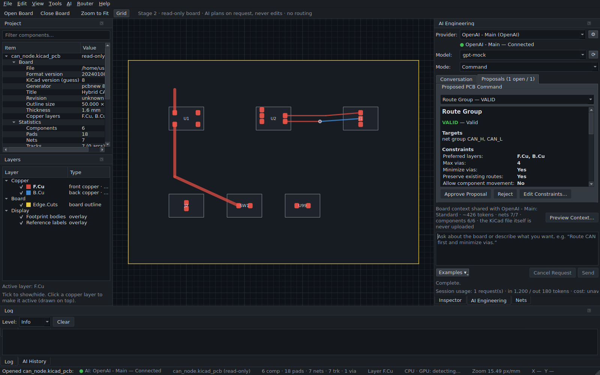
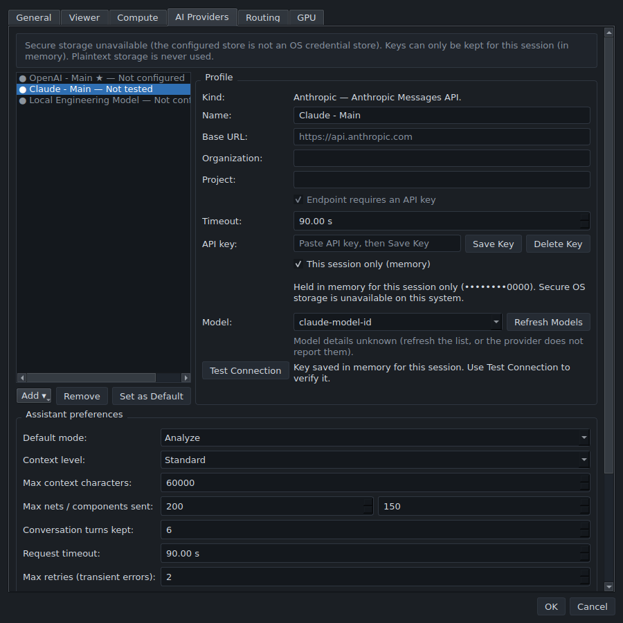
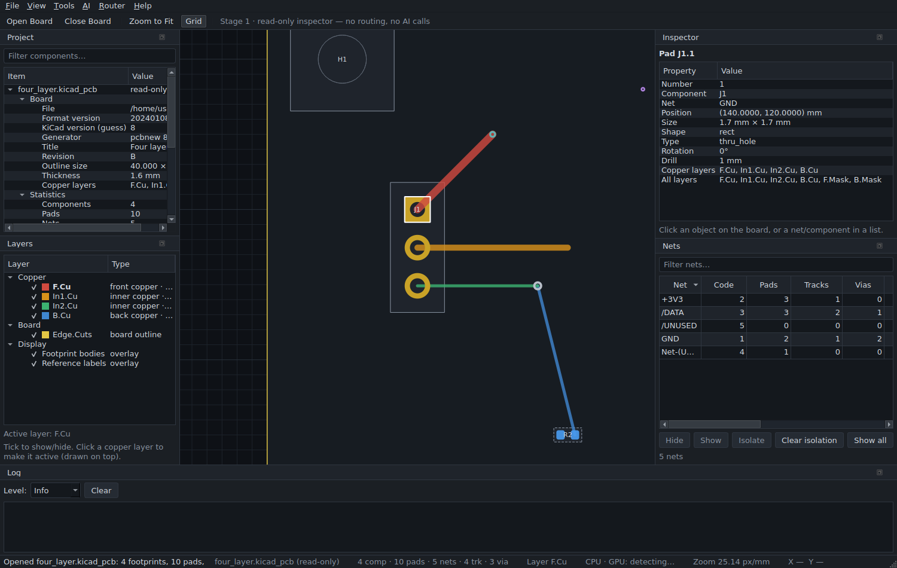
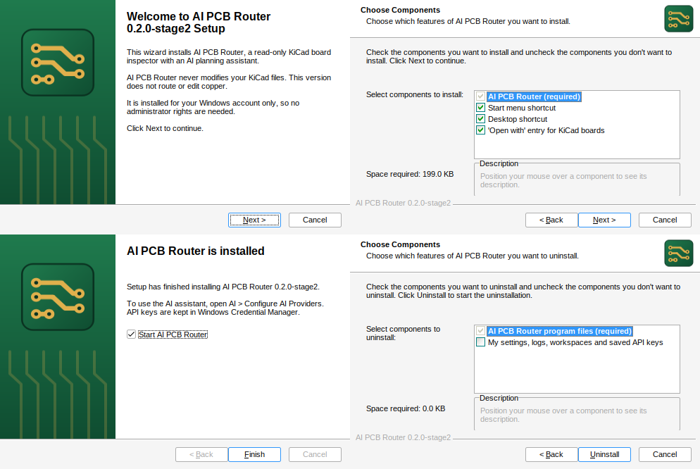

# AI PCB Router

A desktop PCB engineering application for **KiCad** boards: inspect, autoroute
(CPU/GPU), and get AI planning help — deterministically, with every piece of
copper validated and approved by you before it lands on the board.

**Current version: `1.1.1`.**

> **The AI model is a planner, not the router.** It analyses the board and
> proposes structured commands. Every proposal is validated locally and needs
> your approval. **Routing runs deterministically in a worker process; every
> candidate passes the exact geometry validator, and exports write a new
> `.kicad_pcb` — your source files are never modified in place.**

---

## What it does

**Inspect** — Loads `.kicad_pcb` files read-only (KiCad 5–10, best-effort with a
warning for newer files; SHA-256 verified unchanged on close) into an integer
nanometre domain model: 2D viewer (pan/zoom/select), Inspector, Nets, Layers
and Project panels. Unknown values show as *unknown*, never invented.

**Route** — Single-net and full-board autorouting on a working copy:
- CPU A* (optimal) and array-wavefront GPU path (NVIDIA CUDA / Intel oneAPI),
  AUTO selection, CPU fallback; weighted search with a proven cost bound.
- **Accuracy / Speed toggle** in the Route panel: full-resolution optimal
  routing, or coarse-grid weighted routing (~17× faster, ≤1.5× optimal cost).
- 2- and 4-layer boards (x, y, layer search with legal through vias); preferred
  layer directions; coarse-to-fine search inside a corridor.
- **Parallel routing** (Settings ▸ Routing: Auto / Single worker / 2–4): helper
  processes route non-overlapping nets at once, the main process validates and
  commits every result.
- Ordered passes, congestion-aware scheduling, rip-up/reroute, optimisation,
  pause/resume/cancel; **live trace preview** while routing, and cancelling
  keeps already-routed nets for review instead of discarding them.
- Per-net Route Review (candidates, accept/reject) and Routing Jobs batch
  review (accept all/checked, undoable).
- Export to a **new** `.kicad_pcb` (gated by checks), with backups and undo.

**Rules first.** Routing needs stated design rules (track widths/clearances
from net classes in the KiCad project, or per-net Workbench constraints).
Without them the router refuses immediately and says what to set — it never
invents values. Experts can relax this in Settings (conservative handling OFF,
with explicit warning) to route with unknowns reported as warnings.

**AI assistant** — OpenAI, Anthropic, Google Gemini and OpenAI-compatible endpoints (Ollama,
LM Studio, …), local-first: Ollama needs no key and nothing leaves the PC.
Board memory (notes + approved decisions, per board), capability-aware model
list (size/context/thinking badges), versioned planner strategies with a
benchmark. `Ctrl+I`, four modes (Analyze/Plan/Command/Explain), previewable
bounded context, cancel, proposal approve/reject/edit, history with ratings.

**Using it:** [Quick start](docs/QUICK_START.md) · [User guide](docs/USER_GUIDE.md) ·
[Troubleshooting](docs/TROUBLESHOOTING.md) · [Known limitations](KNOWN_LIMITATIONS.md) ·
[Benchmarks](docs/BENCHMARKS.md) · [Release notes](CHANGELOG.md).

Details: [docs/architecture.md](docs/architecture.md) ·
[docs/ai_architecture.md](docs/ai_architecture.md) ·
[docs/security.md](docs/security.md).

## Install on Windows

Download `AI-PCB-Router-<version>-Setup-x64.exe` from
[GitHub Releases](https://github.com/WI7ARD/DAVESROUTER7/releases) and run the
wizard (per-user install, no admin rights). Verify the SHA-256 against the
`.sha256` asset (or `SHA256SUMS.txt`). The installer is not code-signed yet, so
SmartScreen/Chrome may flag it as an uncommon download — in Chrome
use Downloads (`Ctrl+J`) → ⋮ → *Keep dangerous file*; in Edge *Keep anyway*.
Build-it-yourself alternative below; details and silent install:
[docs/windows_installer.md](docs/windows_installer.md).

## Setup from source

```bash
git clone https://github.com/WI7ARD/DAVESROUTER7.git ai-pcb-router
cd ai-pcb-router
python3.12 -m venv .venv
# Linux:   source .venv/bin/activate
# Windows: .venv\Scripts\activate
pip install -e ".[dev]"      # app + AI SDKs + keyring + test tools
# or, for a user install:
pip install -e ".[ai]"       # app + OpenAI/Anthropic SDKs + keyring (+ Gemini via OpenAI-compatible endpoint)
pip install -e .             # app only (AI shows "not installed")
```

Intel GPU support: `pip install dpnp` (oneAPI). NVIDIA: `pip install cupy-cuda12x`.
Minimal Linux installs need Qt system libraries: `sudo apt install libegl1 libgl1
libxkbcommon0 libfontconfig1 libdbus-1-3`. Secure key storage on Linux needs a
Secret Service provider (GNOME Keyring or KWallet).

## Run

```bash
pcbrouter                              # start the desktop app
pcbrouter path/to/board.kicad_pcb      # start and open a board
python -m pcbrouter                    # same, without the console script

pcbrouter board.kicad_pcb --inspect    # headless JSON summary (no GUI)
pcbrouter --version
pcbrouter --diagnostics                # JSON: versions, paths, Qt, AI SDKs, key storage
pcbrouter --gpu-check                  # GPU library/devices report

# route without the window (same pipeline, source never modified):
pcbrouter board.kicad_pcb --route --mode speed --workers -1 --budget 600 \
    --output routed.kicad_pcb --report result.json [--kicad-drc]
# options: --backend cpu|auto|gpu  --layers F.Cu,B.Cu  --grid MM  --overwrite (backs up first)
# exit code 0 = fully routed, 3 = partially routed (file written), 1 = error, 2 = usage
```

Try the bundled fixtures, e.g. `pcbrouter tests/fixtures/boards/can_node.kicad_pcb`.
Route: select a net and press `R`, or Router → Route Board; flip Accuracy/Speed
in the Route panel. For a large synthetic board:
`python tools/generate_synthetic_board.py big.kicad_pcb 60 60`.

### Local AI in 3 steps

1. Install Ollama, then `python -m pcbrouter --setup-ollama qwen2.5:7b`
   (non-thinking models answer fastest; the model list flags thinking models
   and huge-context RAM risk).
2. Open a board, press `Ctrl+I`, ask e.g. *"Which nets are unrouted?"*
3. Review proposals → Approve/Reject. First answers on CPU take ~2 minutes
   (model load + inference); nothing is sent anywhere — it is all local.

### Keyboard shortcuts

| Keys | Action |
|---|---|
| `Ctrl+O` / `Ctrl+W` | Open / close PCB |
| `R` | Route selected net |
| `T` | Hand-draw a trace (click points, `V` via, `Enter` finish, `Esc` cancel) |
| `L` | Lock / unlock selection |
| `Shift+R` | Reroute selected section |
| `Ctrl+Shift+R` | Route board |
| `Ctrl+I` | Show AI Engineering panel |
| `Ctrl+Z` / `Ctrl+Shift+Z` / `Ctrl+Y` | Undo / redo |
| `F` / `G` | Zoom to fit / toggle grid |
| `Ctrl+,` | Settings |
| Middle drag, or `Space` + left drag | Pan |
| `Ctrl+Q` | Exit |

Single-letter shortcuts yield while you type in a filter box, prompt, or
spin box.

### Where files go

| What | Linux | Windows |
|---|---|---|
| Settings (no secrets) | `~/.config/ai-pcb-router/settings.json` | `%APPDATA%\AI PCB Router\settings.json` |
| API keys | OS keyring, service `ai-pcb-router` | Windows Credential Manager |
| Logs | `~/.local/state/ai-pcb-router/logs/` | `%LOCALAPPDATA%\AI PCB Router\logs\` |
| Workspaces / AI memory / history | `~/.local/share/ai-pcb-router/workspaces/` | `%LOCALAPPDATA%\AI PCB Router\workspaces\` |

Override with `PCBROUTER_CONFIG_DIR`, `PCBROUTER_DATA_DIR`, `PCBROUTER_LOG_DIR`.
Nothing is ever written next to your KiCad project.

## Test

```bash
pytest                 # full suite (GUI tests run headless via QT_QPA_PLATFORM=offscreen)
black --check src tests tools packaging
ruff check src tests tools packaging
mypy                   # strict mode, configured in pyproject.toml
python tools/bench_router.py              # routing backend benchmark
python tools/eval_planner.py [--live]     # planner benchmark (live needs Ollama)
```

Automated tests never call a real AI provider. Provider adapters are exercised
through the official SDKs against mocks and a local HTTP server.

## Architecture (short version)

```
  GUI (PySide6)            CLI
       |    \               |
       |   AI panel ──> AIService ──> AIProvider (OpenAI / Anthropic / Gemini / compatible)
       |       |            │  context + board memory → prompt → JSON → parser → validator
       |       v            v                  ▲ versioned prompt strategies
       +--> CommandBus  <── proposals (approve / reject / edit)
                 |
    ProjectManager / HistoryManager / ComputeManager
                 |
  WorkingBoard ──► Router (A* CPU / wavefront GPU) ──► exact validator ──► accept
                 |      ▲ Speed/Accuracy presets
    Domain model (immutable, integer nm)   <--   KiCad adapter (read-only)
```

- **The LLM never modifies board geometry.** Its output is accepted only as a
  strictly validated structured command, previewed and approved by you.
- **The router never guesses rules.** Unknown critical values refuse fast with
  guidance; the exact validator re-checks every segment and via.
- Routing runs in a separate worker process: the UI never blocks, cancel keeps
  partial results, crashes fall back to CPU.

Full details: [docs/architecture.md](docs/architecture.md) and
[docs/ai_architecture.md](docs/ai_architecture.md).

## Security summary

- API keys live only in the OS credential store, or in memory for the session.
  Never in settings, projects, KiCad files, logs, history or exports.
- Nothing is sent to a provider until you configure one and press **Send**. The
  KiCad file itself is never uploaded — only a bounded, previewable summary.
  Names/references/values can be anonymised.
- Board text (e.g. a component value saying "ignore previous instructions") is
  quoted data, never instructions.
- Model output is parsed as JSON only — never executed; the model has no file,
  shell or network access.
- Logs redact key-shaped strings. Full prompts are logged only with an explicit
  debug option.

Full model and audit: [docs/security.md](docs/security.md).

## Roadmap

Stages 1–9 are done (inspector → AI planner → rules/DRC → CPU router →
board routing → constraints → AI tools → GPU → safe export), plus reliability
and speed stages (worker isolation, cancel-keeps-partial, weighted search,
congestion scheduling, Speed/Accuracy presets) and AI capability/memory/
evolution layers. See [docs/roadmap.md](docs/roadmap.md) and
[CHANGELOG.md](CHANGELOG.md).

## Screenshots









## License

Proprietary — see [LICENSE](LICENSE). Purchase grants you the right to install
and use the app on your own computers; redistribution and resale of the app
itself are not permitted. Bundled open-source components keep their own
licenses — see [THIRD-PARTY-NOTICES.md](THIRD-PARTY-NOTICES.md).
